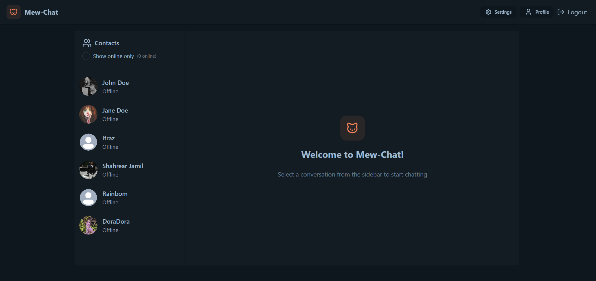
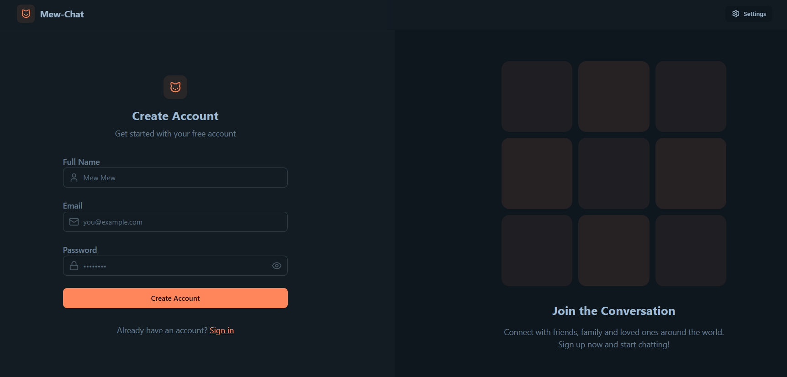
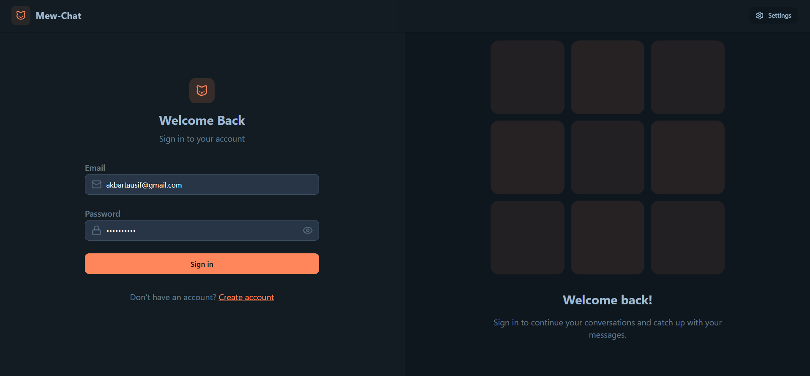
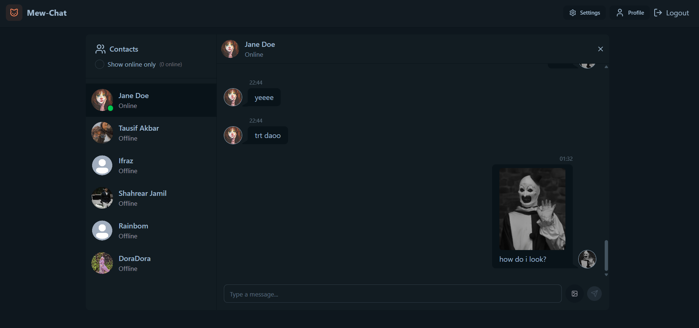
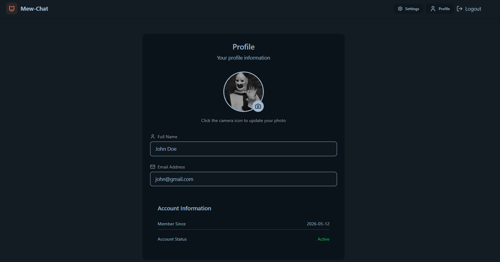
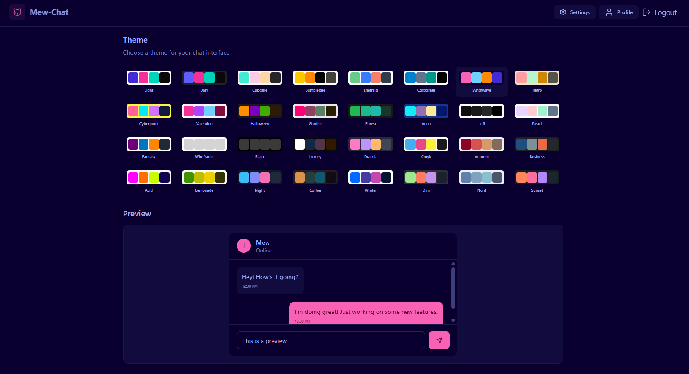

<div align="center">


<br/>

<p>A full-stack real-time chat application built with the MERN stack, featuring instant messaging, image sharing, and a polished UI.</p>

<p>
  
  
  
  
  
  
</p>

<p>
  
  
  
</p>

<p>
  
  
  
</p>

### 🚀 [Live Preview →](https://mew-chatt.onrender.com/)

</div>

---

## ✨ Features

- 🔐 **Authentication** — Secure JWT-based signup & login
- 💬 **Real-time Messaging** — Instant messaging powered by Socket.IO
- 🖼️ **Image Sharing** — Upload and share images via Cloudinary
- 👤 **User Profiles** — Customizable profile with avatar upload
- 🎨 **32 Themes** — Switch between beautiful DaisyUI themes in Settings
- 🟢 **Online Status** — See who's online in real time
- 📱 **Responsive Design** — Works seamlessly on desktop and mobile

---

## 📸 Screenshots

### 🏠 Home


### 📝 Sign Up


### 🔑 Login


### 💬 Chat


### 👤 Profile


### ⚙️ Settings


---

## 🛠️ Tech Stack

### Frontend
| Tech | Purpose |
|------|---------|
| [React](https://react.dev/) | UI library |
| [Tailwind CSS](https://tailwindcss.com/) | Utility-first styling |
| [DaisyUI](https://daisyui.com/) | UI component library & themes |
| [Zustand](https://zustand-demo.pmnd.rs/) | Global state management |
| [Socket.IO Client](https://socket.io/) | Real-time communication |
| [Axios](https://axios-http.com/) | HTTP requests |

### Backend
| Tech | Purpose |
|------|---------|
| [Node.js](https://nodejs.org/) | Runtime environment |
| [Express.js](https://expressjs.com/) | REST API framework |
| [MongoDB](https://www.mongodb.com/) | Database |
| [Mongoose](https://mongoosejs.com/) | ODM for MongoDB |
| [Socket.IO](https://socket.io/) | Real-time WebSocket server |
| [Cloudinary](https://cloudinary.com/) | Image storage & delivery |
| [JWT](https://jwt.io/) | Authentication tokens |
| [bcryptjs](https://github.com/dcodeIO/bcrypt.js) | Password hashing |

---

## 📁 Project Structure

```
Mew-Chat/
├── backend/
│   ├── src/
│   │   ├── controllers/    # Route controllers
│   │   ├── models/         # Mongoose schemas
│   │   ├── routes/         # Express routes
│   │   ├── middleware/     # Auth & error middleware
│   │   ├── lib/            # DB, Cloudinary, Socket setup
│   │   └── index.js        # Server entry point
│   └── package.json
│
├── frontend/
│   ├── src/
│   │   ├── components/     # Reusable UI components
│   │   ├── pages/          # Page-level components
│   │   ├── store/          # Zustand stores
│   │   ├── lib/            # Axios instance & utils
│   │   └── main.jsx        # App entry point
│   └── package.json
│
└── package.json            # Root scripts
```

---

## 🚀 Getting Started

### Prerequisites

- [Node.js](https://nodejs.org/) v18+
- [MongoDB](https://www.mongodb.com/) (local or Atlas)
- [Cloudinary](https://cloudinary.com/) account

### 1. Clone the repository

```bash
git clone https://github.com/niteboy17/Mew-Chat.git
cd Mew-Chat
```

### 2. Set up environment variables

Create a `.env` file inside the `backend/` directory:

```env
PORT=5001
MONGODB_URI=your_mongodb_connection_string
JWT_SECRET=your_jwt_secret_key

CLOUDINARY_CLOUD_NAME=your_cloud_name
CLOUDINARY_API_KEY=your_api_key
CLOUDINARY_API_SECRET=your_api_secret

NODE_ENV=development
```

### 3. Install dependencies

```bash
# Install root + backend dependencies
npm install

# Install frontend dependencies
cd frontend && npm install
```

### 4. Run the app

```bash
# From the root directory — runs both backend and frontend
npm run dev
```

- Frontend: `http://localhost:5173`
- Backend: `http://localhost:5001`

---

## 🌐 API Endpoints

### Auth
| Method | Endpoint | Description |
|--------|----------|-------------|
| `POST` | `/api/auth/signup` | Register a new user |
| `POST` | `/api/auth/login` | Login user |
| `POST` | `/api/auth/logout` | Logout user |
| `PUT`  | `/api/auth/update-profile` | Update profile picture |
| `GET`  | `/api/auth/check` | Check auth status |

### Messages
| Method | Endpoint | Description |
|--------|----------|-------------|
| `GET` | `/api/messages/users` | Get sidebar users |
| `GET` | `/api/messages/:id` | Get messages with a user |
| `POST` | `/api/messages/send/:id` | Send a message |

---

## 🤝 Contributing

Contributions are welcome! Feel free to open issues or pull requests.

1. Fork the repository
2. Create your feature branch: `git checkout -b feature/my-feature`
3. Commit your changes: `git commit -m 'Add my feature'`
4. Push to the branch: `git push origin feature/my-feature`
5. Open a Pull Request

---

## 📄 License

This project is licensed under the [MIT License](LICENSE).

---

<div align="center">

Made with ❤️ by [Tausif](https://github.com/niteboy17)

</div>
